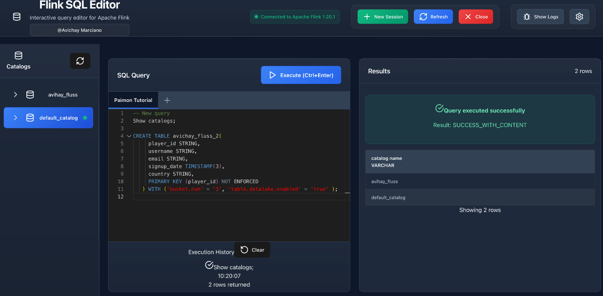

# Flink SQL Editor

An interactive web-based SQL query editor for Apache Flink, built with React and Vite. This tool allows you to write, execute, and manage Flink SQL queries through a modern, user-friendly interface with advanced tab management and persistence features.



## Features

- **Interactive SQL Editor**: Monaco Editor with SQL syntax highlighting and Flink SQL keyword support
- **Tabbed Interface**: Multiple query tabs with persistence across browser sessions
- **Real-time Query Execution**: Execute queries against Flink SQL Gateway REST API
- **Results Visualization**: Display query results in a formatted table
- **Execution History**: Track and revisit previous queries
- **Connection Management**: Configurable Flink SQL Gateway endpoint
- **Catalog Browser**: Left sidebar showing available catalogs with easy switching
- **Stateful Session Management**: Maintains Flink sessions to preserve state between queries using SQL Gateway
- **Modern UI**: Dark theme with responsive design and polished styling
- **Keyboard Shortcuts**: Execute queries with Ctrl+Enter, manage tabs with Ctrl+T/Ctrl+W
- **Tab Persistence**: Automatic saving and restoration of all open tabs and their content

## Tab Management & Persistence

### Multiple Query Tabs
- **Create unlimited tabs** for different queries and workflows
- **Switch between tabs** by clicking or using keyboard shortcuts
- **Rename tabs** by double-clicking the tab name
- **Close tabs** with the X button (minimum one tab always remains)
- **Duplicate tabs** by right-clicking and confirming

### Automatic Persistence
- **All tabs are automatically saved** to browser localStorage
- **Content persists** across browser sessions and page refreshes
- **Tab metadata** including creation time, last modified, and last accessed
- **Smart restoration** - tabs are restored exactly as you left them
- **Version compatibility** checking for cache integrity

### Keyboard Shortcuts
- `Ctrl+T` - Create new tab
- `Ctrl+W` - Close current tab
- `Ctrl+Enter` - Execute query in current tab
- Double-click tab name - Rename tab
- Right-click tab - Duplicate tab

### Cache Management
The editor provides programmatic access to cache management:
- **Export tabs** - Backup all tabs to JSON format
- **Import tabs** - Restore tabs from backup
- **Clear cache** - Reset all tabs (useful for troubleshooting)

## Prerequisites

- Node.js (version 16 or higher)
- Apache Flink cluster with SQL Gateway enabled
- Flink SQL Gateway running on localhost:8083 (or configure custom endpoint)

## Setup

1. **Install dependencies**:
   ```bash
   npm install
   ```

2. **Start Flink SQL Gateway** (if not already running):
   ```bash
   # In your Flink installation directory
   ./bin/start-cluster.sh
   ./bin/sql-gateway.sh start -Dsql-gateway.endpoint.rest.address=localhost
   ```

3. **Start the development server**:
   ```bash
   npm run dev
   ```

4. **Open your browser** and navigate to `http://localhost:3000`

## Usage

### Basic Query Execution

1. Write your Flink SQL query in the editor panel
2. Click the "Execute" button or press `Ctrl+Enter`
3. View results in the right panel
4. Check execution history at the bottom of the editor panel

### Working with Multiple Queries

1. **Create new tabs** using the "+" button or `Ctrl+T`
2. **Switch between tabs** to work on different queries simultaneously
3. **Rename tabs** by double-clicking the tab name for better organization
4. **Duplicate complex queries** by right-clicking tabs
5. All your work is **automatically saved** and will be restored when you return

### Catalog Management

1. **Browse catalogs** in the left sidebar
2. **Switch catalogs** by double-clicking a catalog name
3. **Current catalog** is highlighted with a blue background and green indicator
4. **Refresh catalogs** using the refresh button in the sidebar header

### Example Queries

The editor comes with sample queries to get you started. Thanks to stateful session management, you can execute these queries in sequence and they will maintain context:

```sql
-- Step 1: Create a table (this will persist in the session)
CREATE TABLE sample_data (
  name STRING,
  age INT,
  city STRING
) WITH (
  'connector' = 'values',
  'data-id' = 'sample'
);

-- Step 2: Insert data (executed in the same session context)
INSERT INTO sample_data VALUES
  ('Alice', 25, 'New York'),
  ('Bob', 30, 'San Francisco'),
  ('Charlie', 35, 'London');

-- Step 3: Query the data (table is available from previous steps)
SELECT name, age, city FROM sample_data WHERE age > 25;

-- Step 4: Create a view based on the table
CREATE VIEW adult_users AS 
SELECT name, city FROM sample_data WHERE age >= 25;

-- Step 5: Query the view (both table and view persist in session)
SELECT * FROM adult_users ORDER BY name;
```

**Note**: Because of stateful session management, you can execute these queries one by one, and each subsequent query will have access to the tables and views created in previous executions.

### Configuration

- Click the settings icon in the header to configure the Flink SQL Gateway URL
- Default URL is `http://localhost:8083`
- The connection status is displayed in the header with a green indicator

### Stateful Session Management

The Flink SQL Editor maintains persistent Flink sessions through the SQL Gateway, ensuring that your query context and state are preserved across multiple executions:

- **Session Persistence**: Creates and maintains long-lived Flink sessions that persist beyond individual query executions
- **State Preservation**: Table definitions, temporary views, and catalog contexts remain available across queries
- **Automatic Session Handling**: Intelligent session creation, validation, and recovery
- **Context Continuity**: Execute related queries in sequence while maintaining shared state
- **Session Lifecycle Management**: Automatic session refresh and cleanup when needed

This stateful approach allows you to:
1. **Create tables** in one query and **query them** in subsequent executions
2. **Switch catalogs** and have the context maintained for future queries
3. **Build complex workflows** with dependent queries that share state
4. **Work with temporary views** that persist across query executions

### Session Management

- **New Session**: Start a fresh session (closes current session)
- **Refresh Session**: Restart the current session while preserving configuration
- **Close Session**: End the current session and clean up resources
- **Automatic Validation**: Sessions are validated before each query execution
- **Smart Recovery**: Automatic session recreation if the current session becomes invalid

## API Integration

The application integrates with Flink SQL Gateway REST API v1 with advanced session management:

- **Stateful Session Management**: Creates and manages long-lived Flink sessions with automatic validation
- **State Preservation**: Maintains query context, table definitions, and catalog settings across executions
- **Statement Execution**: Submits SQL statements with operation-based polling for completion
- **Result Retrieval**: Fetches and displays query results with proper formatting and pagination
- **Error Handling**: Displays detailed error messages with Flink-specific information and context
- **Catalog Operations**: Manages catalog switching and browsing with persistent context
- **Session Recovery**: Automatic session recreation and state recovery when sessions expire

## Development

### Project Structure

```
src/
├── components/
│   ├── SqlEditor.jsx          # Monaco-based SQL editor with tabs
│   ├── ResultsDisplay.jsx     # Query results visualization
│   ├── ExecutionHistory.jsx   # Query history management
│   ├── SessionInfo.jsx        # Session status and controls
│   └── CatalogSidebar.jsx     # Catalog browser and management
├── services/
│   ├── flinkApi.js           # Flink SQL Gateway API client
│   ├── sessionManager.js     # Session lifecycle management
│   └── index.js              # Service exports
├── App.jsx                   # Main application component
├── main.jsx                  # React entry point
└── index.css                 # Global styles and theming
```

### Available Scripts

- `npm run dev` - Start development server
- `npm run build` - Build for production
- `npm run preview` - Preview production build
- `npm run lint` - Run ESLint

### Building for Production

```bash
npm run build
```

The built files will be in the `dist/` directory.

## Troubleshooting

### Connection Issues

1. **Ensure Flink SQL Gateway is running**:
   ```bash
   # Check if the gateway is accessible
   curl http://localhost:8083/info
   ```

2. **CORS Issues**: The development server includes a proxy configuration for the Flink API. In production, you may need to configure CORS on the Flink SQL Gateway.

3. **Port Configuration**: If your Flink SQL Gateway runs on a different port, update the URL in the settings panel.

### Tab Persistence Issues

1. **Tabs not restoring**: Check browser localStorage permissions and clear cache if needed
2. **Performance issues**: Use the cache management API to clear old tabs periodically
3. **Import/Export**: Use the programmatic API to backup and restore tabs manually

### Common Errors

- **"HTTP error! status: 404"**: Flink SQL Gateway is not running or not accessible
- **"Failed to fetch"**: Network connectivity issues or CORS problems
- **SQL execution errors**: Check your SQL syntax and table/connector configurations
- **Session timeout**: Use the "New Session" button to create a fresh session

## Contributing

1. Fork the repository
2. Create a feature branch
3. Make your changes
4. Test thoroughly with multiple tabs and persistence scenarios
5. Submit a pull request

## License

This project is open source and available under the MIT License.

## Author

**Avichay Marciano**  
Senior Analytics Specialist @ AWS  
[LinkedIn Profile](https://www.linkedin.com/in/avichaym/)

## Acknowledgments

- Built with [React](https://reactjs.org/) and [Vite](https://vitejs.dev/)
- SQL editing powered by [Monaco Editor](https://microsoft.github.io/monaco-editor/)
- Icons from [Lucide React](https://lucide.dev/)
- Integrates with [Apache Flink SQL Gateway](https://nightlies.apache.org/flink/flink-docs-master/docs/dev/table/sql-gateway/overview/)
- Tab persistence using browser localStorage API
