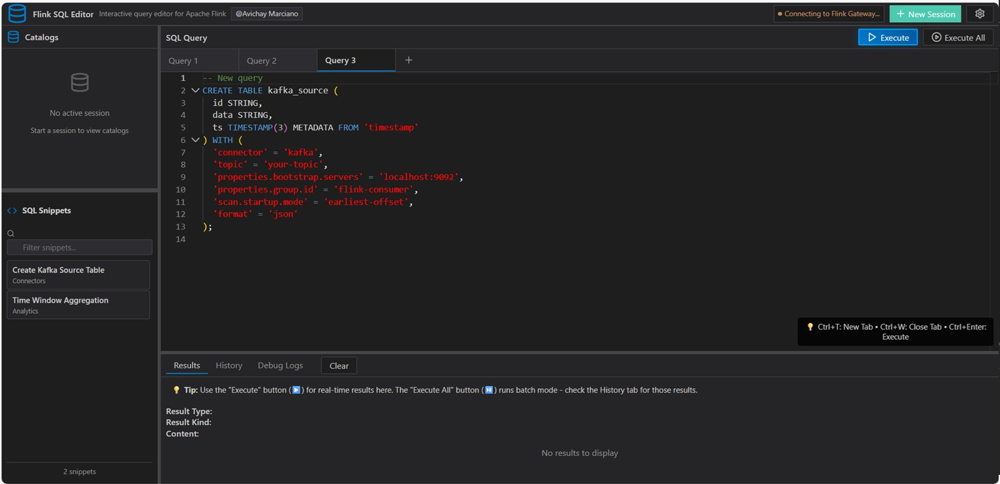

# Flink SQL Editor

An interactive web-based SQL query editor for Apache Flink, built with React and Vite. This tool allows you to write, execute, and manage Flink SQL queries through a modern, user-friendly interface with advanced tab management and persistence features.



## Features

- **Interactive SQL Editor**: Monaco Editor with SQL syntax highlighting and Flink SQL keyword support
- **Tabbed Interface**: Multiple query tabs with persistence across browser sessions
- **Real-time Query Execution**: Execute queries against Flink SQL Gateway REST API
- **Results Visualization**: Display query results in a formatted table
- **Execution History**: Track and revisit previous queries
- **Connection Management**: Configurable Flink SQL Gateway endpoint with authentication support
- **Catalog Browser**: Left sidebar showing available catalogs with easy switching
- **Stateful Session Management**: Maintains Flink sessions to preserve state between queries using SQL Gateway
- **SQL Snippets System**: Reusable SQL templates and patterns loaded from YAML configuration
- **Modern UI**: Dark theme with responsive design and polished styling
- **Keyboard Shortcuts**: Execute queries with Ctrl+Enter, manage tabs with Ctrl+T/Ctrl+W
- **Tab Persistence**: Automatic saving and restoration of all open tabs and their content
- **Environment Variable Support**: Comprehensive configuration through environment variables
- **Authentication Support**: Basic auth, token auth, and SSL configuration options

## Tab Management & Persistence

### Multiple Query Tabs
- **Create unlimited tabs** for different queries and workflows
- **Switch between tabs** by clicking or using keyboard shortcuts
- **Rename tabs** by double-clicking the tab name
- **Close tabs** with the X button (minimum one tab always remains)
- **Duplicate tabs** by right-clicking and confirming

### Automatic Persistence
- **All tabs are automatically saved** to browser localStorage
- **Content persists** across browser sessions and page refreshes
- **Tab metadata** including creation time, last modified, and last accessed
- **Smart restoration** - tabs are restored exactly as you left them
- **Version compatibility** checking for cache integrity

### Keyboard Shortcuts
- `Ctrl+T` - Create new tab
- `Ctrl+W` - Close current tab
- `Ctrl+Enter` - Execute query in current tab
- Double-click tab name - Rename tab
- Right-click tab - Duplicate tab

### Cache Management
The editor provides programmatic access to cache management:
- **Export tabs** - Backup all tabs to JSON format
- **Import tabs** - Restore tabs from backup
- **Clear cache** - Reset all tabs (useful for troubleshooting)

## Prerequisites

- Node.js (version 16 or higher)
- Apache Flink cluster with SQL Gateway enabled
- Flink SQL Gateway running (default: localhost:8083)

## Setup

1. **Install dependencies**:
   ```bash
   npm install
   ```

2. **Configure Flink Gateway** (optional):
   
   Copy the example environment file and configure your settings:
   ```bash
   cp .env.example .env
   ```
   
   Edit `.env` to configure your Flink SQL Gateway connection:
   ```bash
   # Basic configuration
   FLINK_HOST=http://localhost:8083
   
   # For authenticated gateways (choose one method):
   # Basic Authentication
   FLINK_USERNAME=your-username
   FLINK_PASSWORD=your-password
   
   # OR Token Authentication
   FLINK_API_TOKEN=your-bearer-token
   
   # SSL Configuration
   FLINK_SSL_VERIFY=true  # Set to false for self-signed certificates
   ```

3. **Start Flink SQL Gateway** (if not already running):
   ```bash
   # In your Flink installation directory
   ./bin/start-cluster.sh
   ./bin/sql-gateway.sh start -Dsql-gateway.endpoint.rest.address=localhost
   ```

4. **Start the development server**:
   ```bash
   npm run dev
   ```

5. **Open your browser** and navigate to `http://localhost:3000`

## Configuration

### Environment Variables

The application supports comprehensive environment variable configuration for the Flink SQL Gateway connection. Due to Vite's security model, environment variables must be prefixed with `VITE_` to be accessible in the browser.

| Variable | Description | Default | Example |
|----------|-------------|---------|---------|
| `VITE_FLINK_HOST` | Flink SQL Gateway URL | `http://localhost:8083` | `https://flink.example.com:8083` |
| `VITE_FLINK_USERNAME` | Username for basic auth | - | `admin` |
| `VITE_FLINK_PASSWORD` | Password for basic auth | - | `password123` |
| `VITE_FLINK_API_TOKEN` | Bearer token for auth | - | `eyJhbGciOiJIUzI1NiIs...` |
| `VITE_FLINK_SSL_VERIFY` | Verify SSL certificates | `true` | `false` |

#### Setting Up Environment Variables

1. **Copy the example file**:
   ```bash
   cp .env.example .env
   ```

2. **Configure your settings** in `.env`:
   ```bash
   # Local development (no authentication)
   VITE_FLINK_HOST=http://localhost:8083
   
   # Development with basic authentication
   VITE_FLINK_HOST=https://your-flink-server.com:8083
   VITE_FLINK_USERNAME=admin
   VITE_FLINK_PASSWORD=your-password
   
   # Production with token authentication
   VITE_FLINK_HOST=https://your-flink-server.com:8083
   VITE_FLINK_API_TOKEN=eyJhbGciOiJIUzI1NiIsInR5cCI6IkpXVCJ9...
   
   # SSL Configuration (for self-signed certificates)
   VITE_FLINK_SSL_VERIFY=false
   ```

3. **Restart the development server** after making changes to `.env`:
   ```bash
   npm run dev
   ```

#### Authentication Methods

The application supports multiple authentication methods:

- **No Authentication**: Only set `VITE_FLINK_HOST`
- **Basic Authentication**: Set `VITE_FLINK_USERNAME` and `VITE_FLINK_PASSWORD`
- **Token Authentication**: Set `VITE_FLINK_API_TOKEN`

**Note**: Use either basic auth OR token auth, not both. Token auth takes precedence if both are configured.

#### Environment Variable Mapping

If you have OS-level environment variables (e.g., `FLINK_HOST`, `FLINK_USERNAME`), you can map them in your `.env` file:

```bash
# Map OS environment variables to Vite variables
VITE_FLINK_HOST=${FLINK_HOST}
VITE_FLINK_USERNAME=${FLINK_USERNAME}
VITE_FLINK_PASSWORD=${FLINK_PASSWORD}
VITE_FLINK_API_TOKEN=${FLINK_API_TOKEN}
```

### SQL Snippets Configuration

The application includes a powerful SQL snippets system that allows teams to share and reuse common SQL patterns. Snippets are loaded from a YAML configuration file.

#### Snippets File Location

The snippets are loaded from `/public/snippets.yaml`. This file is served statically and can be customized for your team's needs.

#### Snippets File Structure

```yaml
# SQL Snippets Configuration
snippets:
  - name: "Create Kafka Source Table"
    category: "Connectors"
    description: "Create a Kafka source table with common properties"
    sql: |
      CREATE TABLE kafka_source (
        id STRING,
        data STRING,
        ts TIMESTAMP(3) METADATA FROM 'timestamp'
      ) WITH (
        'connector' = 'kafka',
        'topic' = 'your-topic',
        'properties.bootstrap.servers' = 'localhost:9092',
        'properties.group.id' = 'flink-consumer',
        'scan.startup.mode' = 'earliest-offset',
        'format' = 'json'
      );

  - name: "Time Window Aggregation"
    category: "Analytics"
    description: "Tumbling window aggregation example"
    sql: |
      SELECT 
        window_start,
        window_end,
        COUNT(*) as event_count,
        AVG(amount) as avg_amount
      FROM TABLE(
        TUMBLE(TABLE source_table, DESCRIPTOR(event_time), INTERVAL '5' MINUTES)
      )
      GROUP BY window_start, window_end;
```

#### Snippet Properties

Each snippet must include:
- `name`: Display name for the snippet
- `category`: Grouping category (e.g., "Connectors", "Analytics", "Tables")
- `description`: Brief description of what the snippet does
- `sql`: The actual SQL code (can be multi-line using YAML's `|` syntax)

#### Using Snippets

1. **Access Snippets Panel**: Look for the snippets section in the UI (usually in a sidebar or panel)
2. **Search Snippets**: Use the search functionality to filter snippets by name, description, or category
3. **Insert Snippets**: Click on a snippet to insert it into the current editor tab
4. **Copy Snippets**: Use the copy button to copy snippet content to clipboard

#### Customizing Snippets

To customize snippets for your team:

1. **Edit the snippets file**:
   ```bash
   # Edit the public snippets file
   nano public/snippets.yaml
   ```

2. **Add your team's common patterns**:
   ```yaml
   snippets:
     - name: "Your Team's Kafka Setup"
       category: "Team Templates"
       description: "Standard Kafka configuration for our environment"
       sql: |
         CREATE TABLE kafka_setup WITH (
           'connector' = 'kafka',
           'properties.bootstrap.servers' = 'your-kafka-cluster:9092',
           'properties.security.protocol' = 'SASL_SSL',
           'properties.sasl.mechanism' = 'SCRAM-SHA-512',
           'properties.sasl.jaas.config' = 'org.apache.kafka.common.security.scram.ScramLoginModule required username="your-user" password="your-password";'
         );
   ```

3. **Reload the application** or refresh the snippets panel to see your changes

#### Advanced Snippets Features

- **File Upload**: Some implementations support uploading custom snippet files
- **Categories**: Organize snippets into logical categories for better organization
- **Search**: Full-text search across snippet names, descriptions, and categories
- **Multi-line SQL**: Support for complex, multi-statement SQL patterns

#### Example Snippets Categories

Common categories for organizing snippets:
- **Connectors**: Kafka, JDBC, Filesystem connectors
- **Tables**: Table creation patterns, DDL statements
- **Analytics**: Window functions, aggregations, joins
- **Data Processing**: ETL patterns, transformations
- **Administration**: SHOW commands, metadata queries

## Usage

### Basic Query Execution

1. Write your Flink SQL query in the editor panel
2. Click the "Execute" button or press `Ctrl+Enter`
3. View results in the right panel
4. Check execution history at the bottom of the editor panel

### Working with Multiple Queries

1. **Create new tabs** using the "+" button or `Ctrl+T`
2. **Switch between tabs** to work on different queries simultaneously
3. **Rename tabs** by double-clicking the tab name for better organization
4. **Duplicate complex queries** by right-clicking tabs
5. All your work is **automatically saved** and will be restored when you return

### Catalog Management

1. **Browse catalogs** in the left sidebar
2. **Switch catalogs** by double-clicking a catalog name
3. **Current catalog** is highlighted with a blue background and green indicator
4. **Refresh catalogs** using the refresh button in the sidebar header

### SQL Snippets

The application includes a powerful snippets system for reusing common SQL patterns:

1. **Access Snippets**: Look for the snippets panel in the UI (Code icon)
2. **Browse by Category**: Snippets are organized into categories like "Connectors", "Analytics", "Tables"
3. **Search Snippets**: Use the search box to filter snippets by name, description, or category
4. **Insert Snippets**: Click on any snippet to insert it into the current editor tab
5. **Copy Snippets**: Use the copy button to copy snippet content to clipboard
6. **Upload Custom Snippets**: Use the file upload feature to load your own snippet collections

#### Available Snippet Categories:
- **Connectors**: Kafka, JDBC, filesystem connector examples
- **Tables**: Table creation patterns and DDL statements
- **Analytics**: Window functions, aggregations, and analytical queries
- **Data Processing**: ETL patterns and data transformations
- **Administration**: SHOW commands and metadata queries

#### Customizing Snippets:
Edit `/public/snippets.yaml` to add your team's specific SQL patterns and templates.

### Example Queries

The editor comes with sample queries to get you started. Thanks to stateful session management, you can execute these queries in sequence and they will maintain context:

```sql
-- Step 1: Create a table (this will persist in the session)
CREATE TABLE sample_data (
  name STRING,
  age INT,
  city STRING
) WITH (
  'connector' = 'values',
  'data-id' = 'sample'
);

-- Step 2: Insert data (executed in the same session context)
INSERT INTO sample_data VALUES
  ('Alice', 25, 'New York'),
  ('Bob', 30, 'San Francisco'),
  ('Charlie', 35, 'London');

-- Step 3: Query the data (table is available from previous steps)
SELECT name, age, city FROM sample_data WHERE age > 25;

-- Step 4: Create a view based on the table
CREATE VIEW adult_users AS 
SELECT name, city FROM sample_data WHERE age >= 25;

-- Step 5: Query the view (both table and view persist in session)
SELECT * FROM adult_users ORDER BY name;
```

**Note**: Because of stateful session management, you can execute these queries one by one, and each subsequent query will have access to the tables and views created in previous executions.

### Configuration

- Click the settings icon in the header to configure the Flink SQL Gateway URL
- Default URL is `http://localhost:8083`
- The connection status is displayed in the header with a green indicator

### Stateful Session Management

The Flink SQL Editor maintains persistent Flink sessions through the SQL Gateway, ensuring that your query context and state are preserved across multiple executions:

- **Session Persistence**: Creates and maintains long-lived Flink sessions that persist beyond individual query executions
- **State Preservation**: Table definitions, temporary views, and catalog contexts remain available across queries
- **Automatic Session Handling**: Intelligent session creation, validation, and recovery
- **Context Continuity**: Execute related queries in sequence while maintaining shared state
- **Session Lifecycle Management**: Automatic session refresh and cleanup when needed

This stateful approach allows you to:
1. **Create tables** in one query and **query them** in subsequent executions
2. **Switch catalogs** and have the context maintained for future queries
3. **Build complex workflows** with dependent queries that share state
4. **Work with temporary views** that persist across query executions

### Session Management

- **New Session**: Start a fresh session (closes current session)
- **Refresh Session**: Restart the current session while preserving configuration
- **Close Session**: End the current session and clean up resources
- **Automatic Validation**: Sessions are validated before each query execution
- **Smart Recovery**: Automatic session recreation if the current session becomes invalid

## API Integration

The application integrates with Flink SQL Gateway REST API v1 with advanced session management:

- **Stateful Session Management**: Creates and manages long-lived Flink sessions with automatic validation
- **State Preservation**: Maintains query context, table definitions, and catalog settings across executions
- **Statement Execution**: Submits SQL statements with operation-based polling for completion
- **Result Retrieval**: Fetches and displays query results with proper formatting and pagination
- **Error Handling**: Displays detailed error messages with Flink-specific information and context
- **Catalog Operations**: Manages catalog switching and browsing with persistent context
- **Session Recovery**: Automatic session recreation and state recovery when sessions expire

## Development

### Project Structure

```
src/
├── components/
│   ├── SqlEditor.jsx          # Monaco-based SQL editor with tabs
│   ├── ResultsDisplay.jsx     # Query results visualization
│   ├── ExecutionHistory.jsx   # Query history management
│   ├── SessionInfo.jsx        # Session status and controls
│   ├── CatalogSidebar.jsx     # Catalog browser and management
│   ├── SnippetsPanel.jsx      # Advanced snippets panel with categories
│   ├── SimpleSnippets.jsx     # Simple snippets component
│   └── SettingsPanel.jsx      # Configuration panel
├── services/
│   ├── flinkApi.js           # Flink SQL Gateway API client
│   ├── sessionManager.js     # Session lifecycle management
│   ├── statementManager.js   # Statement execution orchestration
│   ├── settingsService.js    # Configuration and environment management
│   └── index.js              # Service exports
├── hooks/
│   ├── useStatementExecution.js  # Statement execution hook
│   └── useResizable.js           # Resizable panels hook
├── utils/
│   └── sqlParser.js          # SQL parsing utilities
├── App.jsx                   # Main application component
├── main.jsx                  # React entry point
└── index.css                 # Global styles and theming

public/
├── snippets.yaml             # SQL snippets configuration
└── index.html                # HTML template

Configuration:
├── .env.example              # Environment variables template
├── vite.config.js            # Build and development configuration
└── package.json              # Dependencies and scripts
```

### Available Scripts

- `npm run dev` - Start development server
- `npm run build` - Build for production
- `npm run preview` - Preview production build
- `npm run lint` - Run ESLint

### Building for Production

```bash
npm run build
```

The built files will be in the `dist/` directory.

## Troubleshooting

### Connection Issues

1. **Ensure Flink SQL Gateway is running**:
   ```bash
   # Check if the gateway is accessible
   curl http://localhost:8083/info
   ```

2. **CORS Issues**: The development server includes a proxy configuration for the Flink API. In production, you may need to configure CORS on the Flink SQL Gateway.

3. **Port Configuration**: If your Flink SQL Gateway runs on a different port, update the URL in the settings panel or environment variables.

### Environment Variables Issues

1. **Variables not loading**: Ensure all environment variables are prefixed with `VITE_`:
   ```bash
   # Correct
   VITE_FLINK_HOST=http://localhost:8083
   
   # Incorrect (won't work in browser)
   FLINK_HOST=http://localhost:8083
   ```

2. **Environment changes not applied**: Restart the development server after changing `.env`:
   ```bash
   npm run dev
   ```

3. **Authentication not working**: Check that you're using either basic auth OR token auth, not both:
   ```bash
   # Basic auth
   VITE_FLINK_HOST=https://example.com:8083
   VITE_FLINK_USERNAME=admin
   VITE_FLINK_PASSWORD=password
   
   # OR token auth (not both)
   VITE_FLINK_HOST=https://example.com:8083
   VITE_FLINK_API_TOKEN=your-token
   ```

### Snippets Issues

1. **Snippets not loading**: Check that `/public/snippets.yaml` exists and is valid YAML:
   ```bash
   # Validate YAML syntax
   npm install -g js-yaml
   js-yaml public/snippets.yaml
   ```

2. **Snippets file format**: Ensure your snippets file follows the correct structure:
   ```yaml
   snippets:
     - name: "Snippet Name"
       category: "Category"
       description: "Description"
       sql: |
         SELECT * FROM table;
   ```

3. **Upload issues**: When uploading custom snippets, ensure the file has a `.yaml` or `.yml` extension.

### Tab Persistence Issues

1. **Tabs not restoring**: Check browser localStorage permissions and clear cache if needed
2. **Performance issues**: Use the cache management API to clear old tabs periodically
3. **Import/Export**: Use the programmatic API to backup and restore tabs manually

### Common Errors

- **"HTTP error! status: 404"**: Flink SQL Gateway is not running or not accessible
- **"Failed to fetch"**: Network connectivity issues or CORS problems
- **SQL execution errors**: Check your SQL syntax and table/connector configurations
- **Session timeout**: Use the "New Session" button to create a fresh session
- **"Failed to load snippets"**: Check that `/public/snippets.yaml` exists and is accessible

## Contributing

1. Fork the repository
2. Create a feature branch
3. Make your changes
4. Test thoroughly with multiple tabs and persistence scenarios
5. Submit a pull request

## License

This project is open source and available under the MIT License.

## Authors

**Avichay Marciano**  
Senior Analytics Specialist @ AWS  
[LinkedIn Profile](https://www.linkedin.com/in/avichaym/)

## Acknowledgments

- Built with [React](https://reactjs.org/) and [Vite](https://vitejs.dev/)
- SQL editing powered by [Monaco Editor](https://microsoft.github.io/monaco-editor/)
- Icons from [Lucide React](https://lucide.dev/)
- Integrates with [Apache Flink SQL Gateway](https://nightlies.apache.org/flink/flink-docs-master/docs/dev/table/sql-gateway/overview/)
- Tab persistence using browser localStorage API
